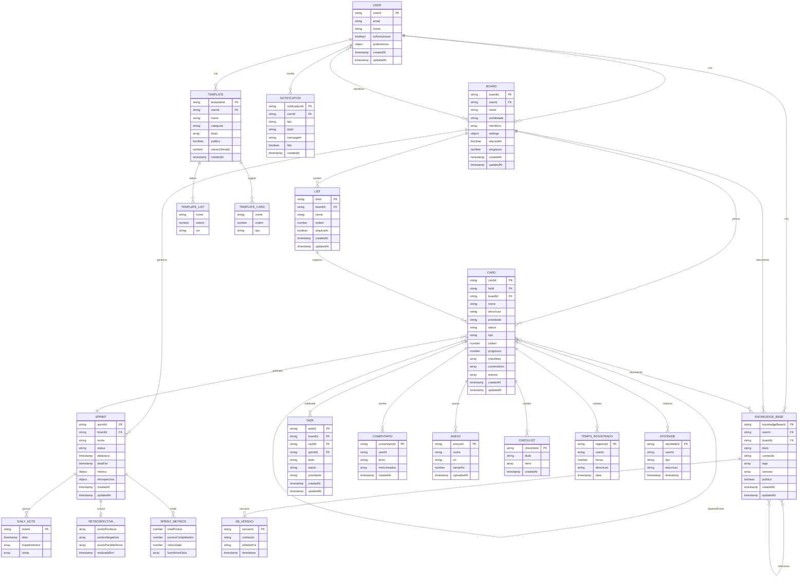
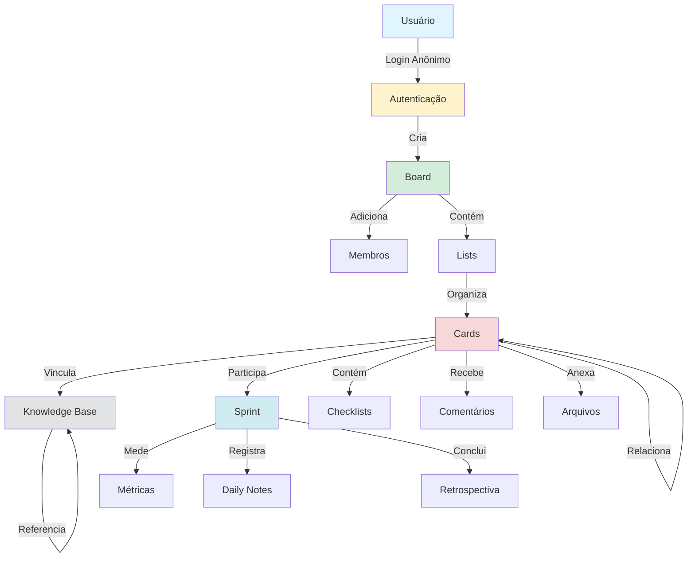
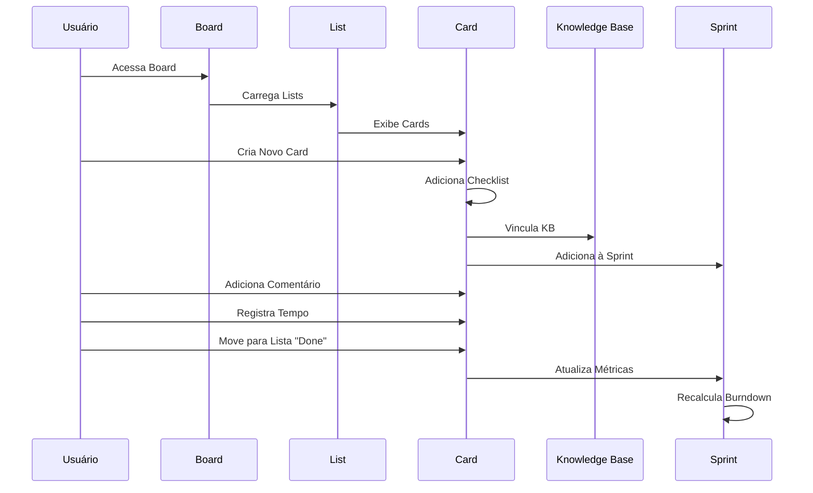
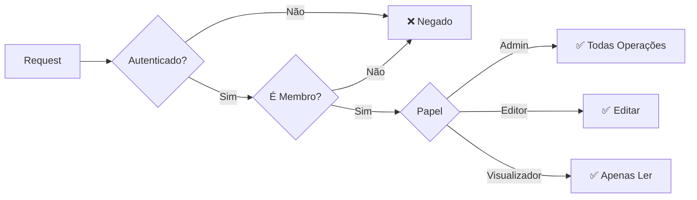

# Diagrama da Estrutura do Banco de Dados

## Diagrama de Entidades e Relacionamentos (ER)



## Diagrama de Fluxo de Dados Principal



## Hierarquia de Dados

```
🌐 Aplicação
│
├── 👤 Usuários
│   ├── Perfil e Preferências
│   ├── Notificações
│   └── Knowledge Base Pessoal
│
├── 📋 Boards (Projetos)
│   │
│   ├── 👥 Membros
│   │   ├── Admin
│   │   ├── Editor
│   │   └── Visualizador
│   │
│   ├── 📝 Lists (Colunas Kanban)
│   │   └── 🎯 Cards (Tarefas)
│   │       ├── Checklists
│   │       ├── Comentários
│   │       ├── Anexos
│   │       ├── Tempo Registrado
│   │       ├── Histórico
│   │       └── Subtarefas
│   │
│   ├── 🏃 Sprints (Scrum)
│   │   ├── Cards da Sprint
│   │   ├── Métricas
│   │   ├── Burndown Chart
│   │   ├── Daily Notes
│   │   └── Retrospectiva
│   │
│   └── 📚 Knowledge Base
│       ├── Documentos
│       ├── Links Bidirecionais
│       └── Versionamento
│
└── 📄 Templates
    ├── Lists Padrão
    └── Cards Exemplo
```

## Fluxo de Criação de Card Completo



## Índices e Performance

### Índices Principais por Coleção

#### Boards
- `userId + arquivado + updatedAt`
- `membros.userId + arquivado + updatedAt`
- `visibilidade + updatedAt`

#### Cards
- `boardId + listId + ordem`
- `boardId + responsavel + status`
- `boardId + sprintId + status`
- `boardId + dataVencimento`
- `responsavel + status + dataVencimento`

#### Knowledge Base
- `userId + updatedAt`
- `boardId + categoria + updatedAt`
- `tags + updatedAt`

#### Sprints
- `boardId + status + dataInicio`
- `boardId + numero`

## Regras de Segurança - Resumo



## Otimizações Implementadas

### 1. Desnormalização Estratégica
- ✅ Nome de usuários em cards
- ✅ Lista de membros em boards
- ✅ Contadores e métricas

### 2. Índices Compostos
- ✅ 28 índices otimizados
- ✅ Queries complexas eficientes
- ✅ Ordenação e filtros rápidos

### 3. Real-time Seletivo
- ✅ Listeners apenas para board ativo
- ✅ Paginação em listas longas
- ✅ Cache local automático

### 4. Batch Operations
- ✅ Múltiplas escritas agrupadas
- ✅ Redução de custos
- ✅ Operações atômicas

## Capacidade e Limites

### Plano Gratuito (Spark)
- **Leituras**: 50.000/dia
- **Escritas**: 20.000/dia
- **Armazenamento**: 1GB
- **Ideal para**: Desenvolvimento e pequenos projetos

### Estimativa de Uso
- **Board pequeno**: ~100 reads/dia
- **Board médio**: ~500 reads/dia
- **Board grande**: ~2000 reads/dia

### Quando Escalar
- Mais de 20 boards ativos
- Mais de 100 usuários simultâneos
- Mais de 1000 cards no total

---

**Visualize este documento no GitHub ou em um visualizador Markdown com suporte a Mermaid para ver os diagramas renderizados.**
